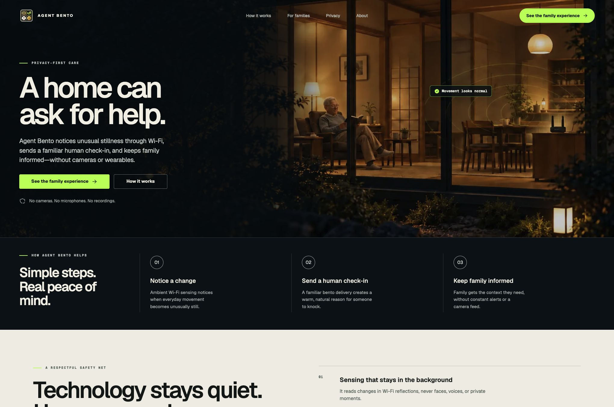
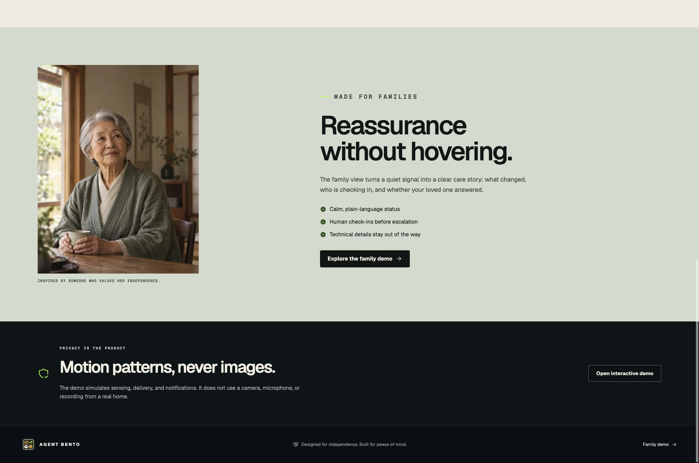
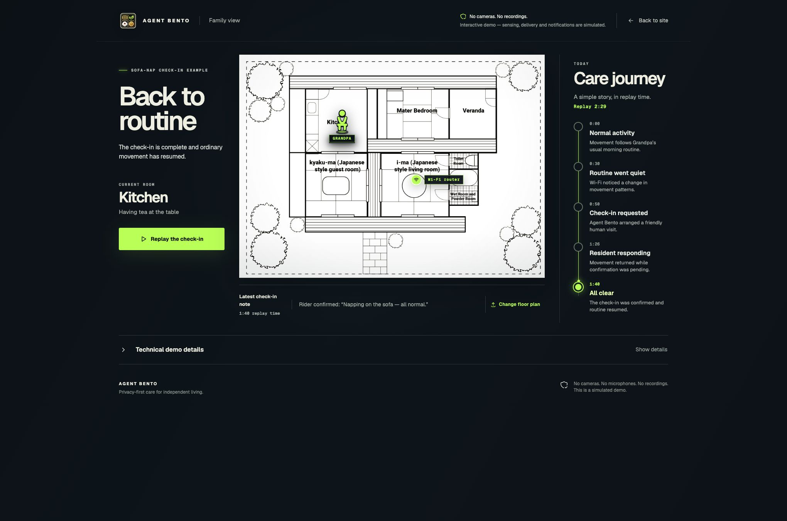
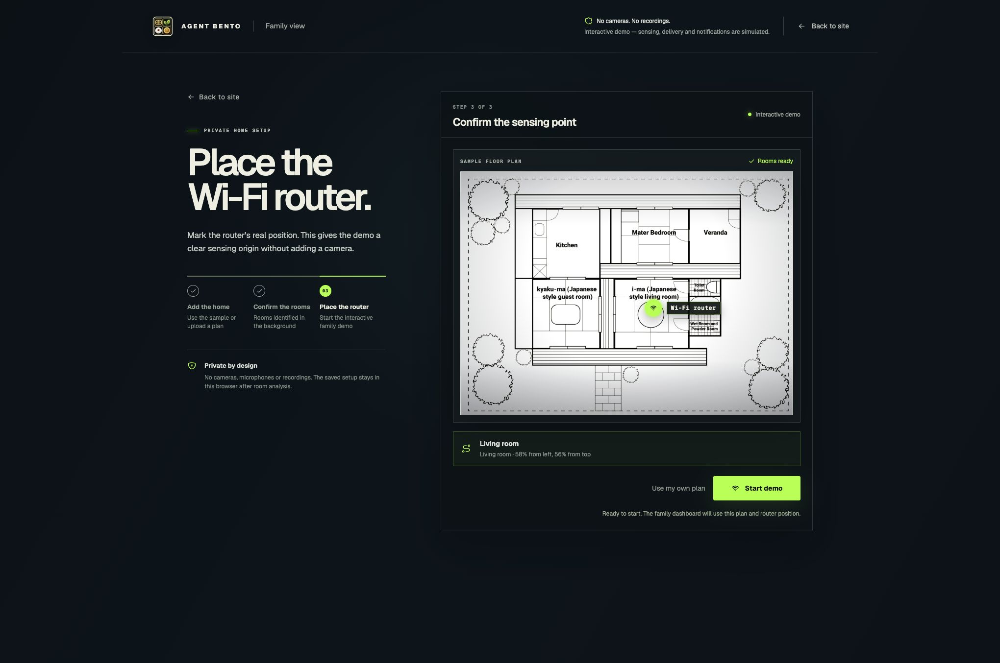
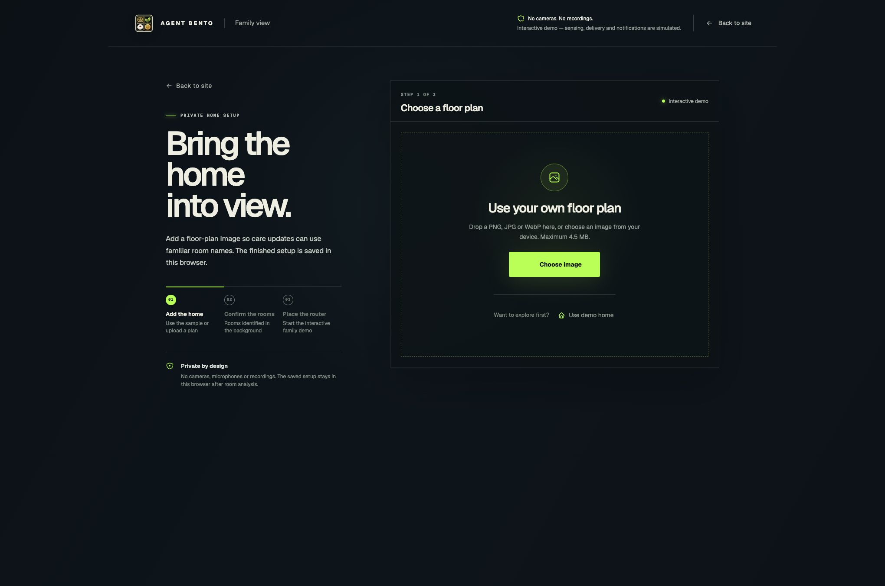
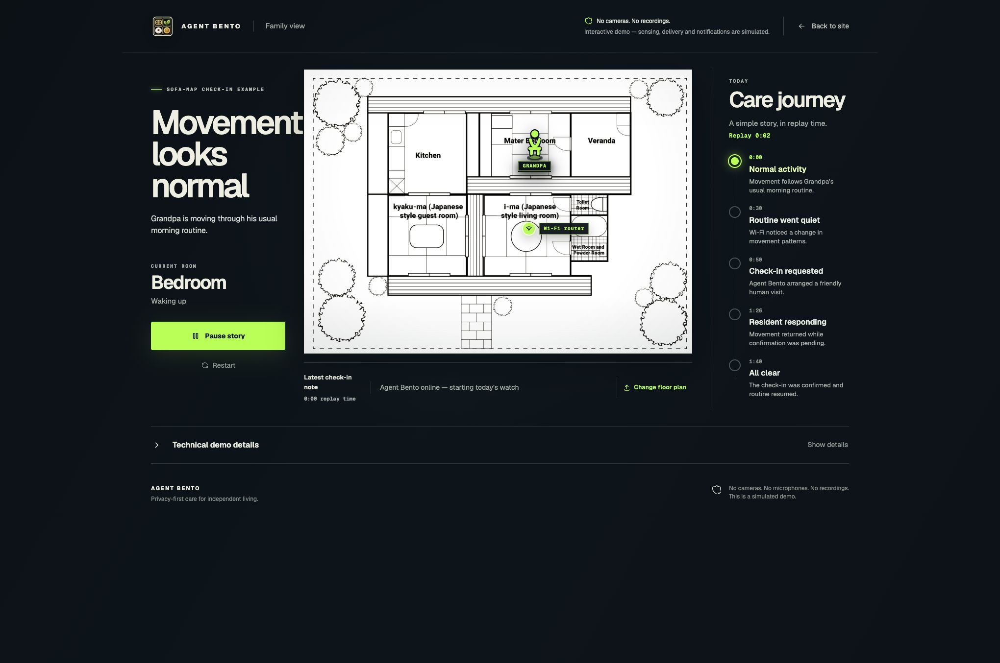
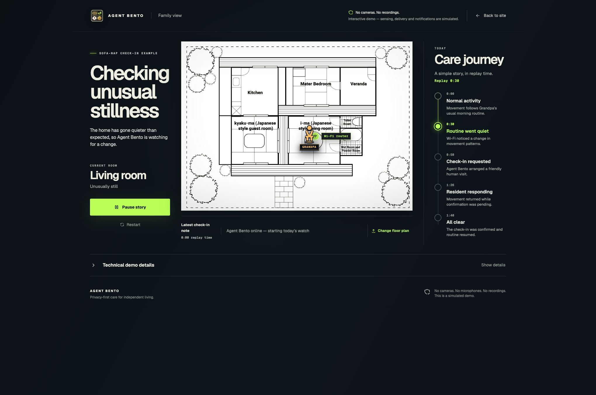
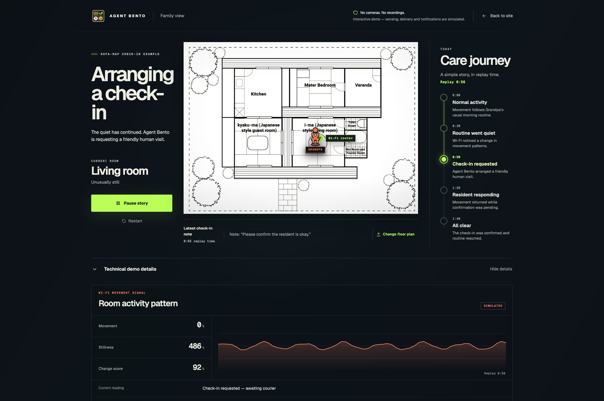

# Agent Bento product experience audit

## Resolution status

All six highest-impact recommendations were implemented after this review:

- Landing demo links now open a fresh replay and begin at normal activity.
- **Change floor plan** now opens the plan chooser directly.
- The custom-plan chooser discloses provider processing before file selection.
- The care journey now includes **Back to routine · 2:00**, driven by the shared replay clock.
- Technical inputs use plain labels, readable durations, and an explicit explanation of their time basis.
- Essential status, replay, trust, and setup labels were increased for readability.

Post-fix checks covered the 390px mobile layout, 1280px desktop layout, replay jumps, setup recovery, console errors, lint, TypeScript, unit tests, production build, and rendered-page assertions.

## Audit scope

Combined UX and accessibility review of the production landing page, returning-family dashboard, setup recovery, demo-home path, replay states, care journey, and technical disclosure at `https://agentbendo.vercel.app`.

The intended user goal is to understand the privacy-first care promise, enter the family experience with confidence, configure a home without fear of losing progress, and understand what is happening during a check-in. The accessibility target is a clear, keyboard-reachable experience with readable status communication for family caregivers, including people with reduced vision or motion sensitivity.

## Overall verdict

The product now feels coherent and credible. The landing page is especially strong: it leads with a human need, shows the product in a realistic home, and makes privacy part of the proposition. Setup and the dashboard share the same visual language, and the replay is internally synchronized.

Three experience gaps keep it from feeling fully finished:

1. The landing CTA can open the dashboard on the resolved ending instead of the start of the demo.
2. **Change floor plan** opens router placement before the plan chooser.
3. The upload step does not clearly disclose, before selection, that the image is sent to a configured room-analysis provider.

## Captured flow

### Step 1 — Landing hero · Healthy

- The proposition, primary action, and privacy promise are visible without scrolling.
- The photography and restrained signal overlay make the product feel calm and real.
- The header trust text and small mono labels are visually subtle; they may be difficult for low-vision users.

### Step 2 — Family and privacy sections · Healthy

- The family benefit is specific: understand what changed, who is checking in, and whether the resident answered.
- The privacy section sets the correct boundary between this simulation and a real home.
- Repeated demo CTAs are consistent and give long-page visitors a clear next action.

### Step 3 — Returning-family dashboard · Needs refinement

- Status, room, floor plan, care journey, and latest note form a clear hierarchy.
- A visitor arriving from **See the family experience** sees **Back to routine** and `Replay 2:29`, revealing the ending before the demo begins.
- The journey ends at **All clear · 1:40** while the current state reads **Back to routine · 2:29**. The missing routine-resumed milestone makes the final 49 seconds feel unexplained.
- The source floor plan remains visually dense, with small room labels competing with the resident and router markers.

### Step 4 — Change-floor-plan destination · Needs refinement

- Router placement is clear, the three-step model is visible, and **Start demo** is prominent.
- **Change floor plan** lands on step 3, **Place the Wi-Fi router**, instead of the plan chooser. The user must discover **Use my own plan** to perform the action they requested.
- The current-plan state is useful, so this screen would work well under a broader label such as **Edit home setup**.

### Step 5 — Custom floor-plan upload · Needs attention

- File types, size limit, primary upload action, and **Use demo home** recovery are easy to find.
- The privacy copy says the finished setup stays in the browser after room analysis, but it does not plainly say before upload that the image is sent to the configured room-analysis provider.
- In a privacy-first product, that processing disclosure should appear beside the chooser, before the user selects a personal home plan.

### Step 6 — Replay start · Healthy

- The page starts with normal movement, selects the matching journey point, and uses one replay clock.
- **Pause story** and **Restart** are clear, and the active stage is communicated through text and position as well as color.
- The resident marker is legible, though the source plan text is still much smaller than the surrounding product interface.

### Step 7 — Unusual stillness · Healthy

- Headline, explanation, room, resident color, and selected journey stage agree.
- The language is measured and avoids a premature emergency or medical claim.
- The latest-note area still shows the prior 0:00 update at the exact 0:30 boundary. The timestamp makes this technically accurate, but a short **Watching for change** note would reduce perceived lag.

### Step 8 — Technical disclosure · Needs refinement

- The simplified two-dimensional panel is much calmer than the previous diagnostics view.
- It correctly avoids heart-rate, respiration, provider-status, and clinical-monitoring claims.
- **Stillness 486s** appears beside **Replay 0:56** without explaining that sensor history predates replay time. The two clocks look contradictory.
- **Change score 92%** has no definition, baseline, or threshold, so it adds precision without helping a family member make a decision.
- Either explain these values as simulated sensor inputs or simplify the disclosure to the current reading and a small activity trace.

## Strengths

- Strong human-centered landing narrative and premium visual execution.
- Privacy is stated repeatedly at the moments where trust matters.
- Setup is recoverable and the sample path is easy to use.
- Dashboard states, map markers, care stages, notes, and replay controls stay synchronized.
- Native links, buttons, headings, disclosure semantics, selected-state information, live status text, and reduced-motion handling are present in the implementation.

## Highest-impact recommendations

1. Make **See the family experience** start at normal activity at replay 0:00, while preserving a separate returning-family route or current-state view if needed.
2. Make **Change floor plan** open the plan chooser, or rename it **Edit home setup** when it opens the current router step.
3. Add explicit pre-upload disclosure: the floor-plan image is sent to the configured room-analysis provider, then the resulting setup is stored in this browser.
4. Add **Back to routine · 2:00** to the journey or stop the calm-state clock at the final visible milestone.
5. Explain the technical metrics and their time basis, or reduce the panel to a trace plus plain-language current reading.
6. Increase the smallest trust, helper, and mono labels to at least 12px with measured contrast appropriate for the dark surfaces.

## Accessibility risks and evidence limits

- The screenshots show several small, muted labels and footer notes. Contrast and minimum text size should be measured rather than assumed compliant.
- The floor-plan image contains small embedded labels. The surrounding status provides the current room, but the complete plan structure is not conveyed as text in the captured dashboard state.
- This audit confirmed DOM semantics and state labels visible through the in-app browser. It did not recapture mobile reflow, 200% zoom, every keyboard focus state, screen-reader announcements, upload errors, or a real provider-analysis response in this run.
- No claim of full WCAG compliance is made.
